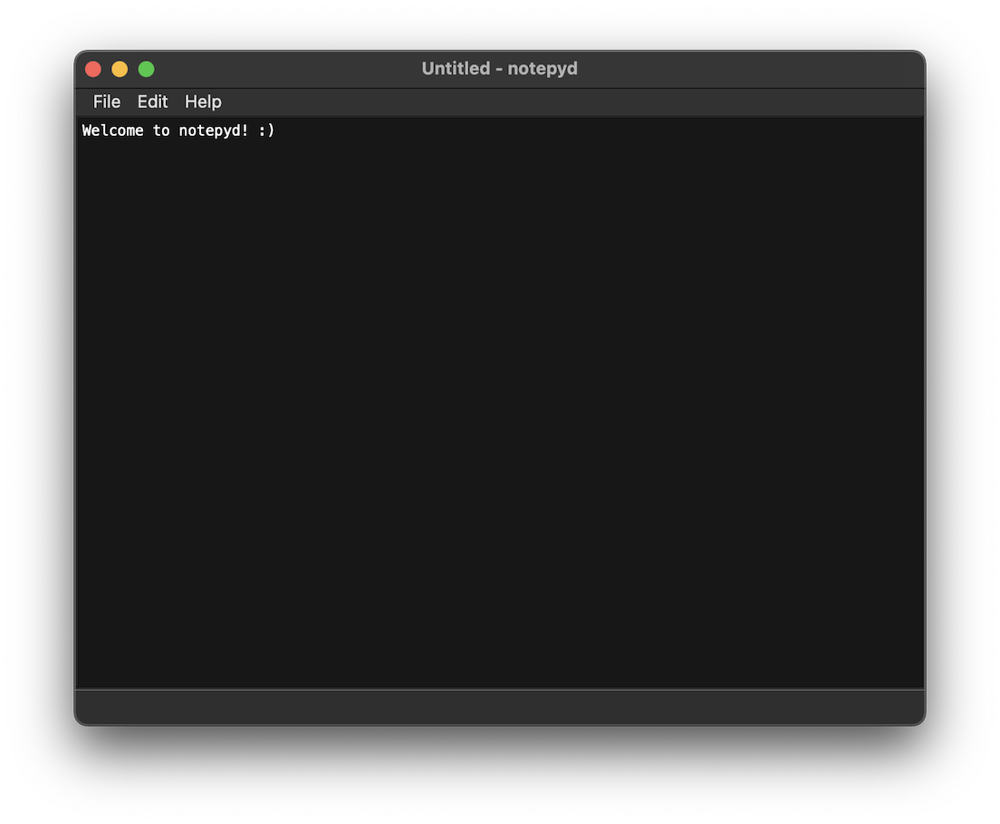

# notepyd

A lightweight notepad clone written in Python using the PyQt6 library and based off of this nice PyQt5 tutorial by Jie Jenn: https://www.youtube.com/watch?v=zx9OFYy5Xhs

Icons are free for commercial use from: https://www.iconfinder.com/

